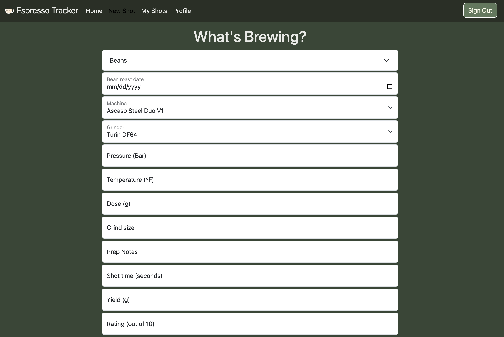

# Espresso Tracker

[](https://app.netlify.com/sites/espresso-tracker-cody-keener/deploys)
(https://app.netlify.com/sites/espresso-tracker-cody-keener/deploys)

Welcome to Espresso Tracker! Whether you are a professional barista or brand new to the hobby, you will be able to track all of the shots you pull to make sure you are set up for success every time.  Life is too short to drink bad espresso, so use Espresso Tracker to pull the perfect shot every time!

[View App](#https://espresso-tracker-cody-keener.netlify.app)

## Get Started
//function that returns the ShotForm component
```
export default function newShot() {
  return <ShotForm />;
}
```

## About the User
- The ideal user for this application is anyone who makes espresso
- They want to track the parameters of the shots they pull to fine tune their settings and pull the best shots they can
- The problem this app solves for them is that it allows users to track all of the variables that go into making espresso to see what settings make the best espresso

## Features
- Sign in with Google
- Create a new shot on the New Shot page
- See your past shots on the My Shots page
- Add a profile on the Profile page
- Set you default shot parameters on the Profile page
- Create, Read, Update, and Delete shots

## Video Walkthrough of Espresso Tracker
COMING SOON

## Relevant Links
- [Check out the deployed site](#https://espresso-trackers-cody-keener.netlify.app/#)

## Code Snippet
<!-- //function that displays a sidebar to create a new Bean -->

```
const sideBarToggle = () => {
    if (sideBar === null) {
      setSideBar(
        <>
          <div style={{
            minWidth: '350px', marginTop: '64px', border: '2px solid white', borderRadius: '5px',
          }}
          >
            <BeanForm onUpdate={beanFormSubmit} />
          </div>
        </>,
      );
    } else {
      setSideBar(null);
    }
  };
```

## Project Screenshots


## Contributors
- Cody Keener (https://github.com/codyKeener)

## ------------------------------------------------------------------------------------------ ##

## Instructions I followed:

## Goals
See the Front End Capstone Planning Expectations doc: https://docs.google.com/document/d/1ygmif9xV9T90wdtGoIHoqxNDfBH6bswQ9nyHjt2U34k/edit?usp=sharing

## Instructions
See the Front End Capstone Planning Expectations doc: https://docs.google.com/document/d/1ygmif9xV9T90wdtGoIHoqxNDfBH6bswQ9nyHjt2U34k/edit?usp=sharing


<!-- [See Demo](https://drt-sortinghat.netlify.app/)
 -->
## Technical Requirements
See the Front End Capstone Planning Expectations doc: https://docs.google.com/document/d/1ygmif9xV9T90wdtGoIHoqxNDfBH6bswQ9nyHjt2U34k/edit?usp=sharing

## DEFINITION OF DONE
Once you have completed all the technical requirments, you should complete the following:
- [README Requirements](https://github.com/orgs/nss-evening-web-development/discussions/13)
- **RECOMMENDED** Loom Video: [Sign up for Loom](https://www.loom.com/signup) and record a video of you walking through your app
